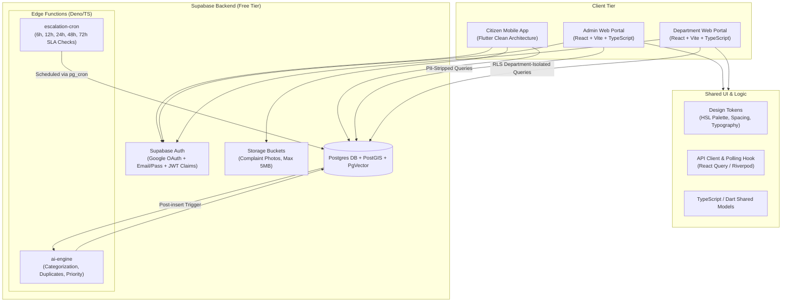

# Namma Prahari — System Architecture & Design System

## System Architecture



---

## Codebase Folder Structure

### 1. Citizen Mobile App (`/mobile_app`)
```
mobile_app/
├── android/
├── ios/
├── web/
├── lib/
│   ├── main.dart
│   ├── core/
│   │   ├── config/env_config.dart
│   │   ├── constants/colors.dart
│   │   ├── network/supabase_client.dart
│   │   ├── services/gps_service.dart
│   │   ├── services/camera_service.dart
│   │   ├── theme/app_theme.dart
│   │   └── utils/image_validator.dart
│   ├── data/
│   │   ├── datasources/complaint_remote_datasource.dart
│   │   ├── models/complaint_model.dart
│   │   └── repositories/complaint_repository_impl.dart
│   ├── domain/
│   │   ├── entities/complaint_entity.dart
│   │   ├── repositories/complaint_repository.dart
│   │   └── usecases/submit_complaint_usecase.dart
│   └── presentation/
│       ├── providers/complaint_provider.dart
│       ├── screens/
│       │   ├── auth/login_screen.dart
│       │   ├── home/home_dashboard.dart
│       │   ├── report/gps_gate_screen.dart
│       │   ├── report/camera_screen.dart
│       │   ├── report/complaint_form_screen.dart
│       │   ├── tracking/complaint_detail_screen.dart
│       │   ├── leaderboard/leaderboard_screen.dart
│       │   └── profile/profile_screen.dart
│       └── widgets/
│           ├── gps_dialog.dart
│           ├── complaint_card.dart
│           └── timeline_view.dart
└── pubspec.yaml
```

### 2. Admin Web Portal (`/admin_portal`)
```
admin_portal/
├── src/
│   ├── main.tsx
│   ├── App.tsx
│   ├── components/
│   │   ├── Navbar.tsx
│   │   ├── Sidebar.tsx
│   │   ├── ComplaintMap.tsx
│   │   └── RepresentativeCard.tsx
│   ├── features/
│   │   ├── dashboard/AdminDashboard.tsx
│   │   ├── complaints/ComplaintList.tsx
│   │   ├── complaints/ComplaintDetailModal.tsx
│   │   ├── analytics/AnalyticsCharts.tsx
│   │   └── reports/ReportGenerator.tsx
│   ├── hooks/usePolling.ts
│   ├── services/adminApi.ts
│   └── types/admin.ts
├── package.json
└── vite.config.ts
```

### 3. Department Web Portal (`/department_portal`)
```
department_portal/
├── src/
│   ├── main.tsx
│   ├── App.tsx
│   ├── components/
│   │   ├── DeptHeader.tsx
│   │   └── StatusTransitionModal.tsx
│   ├── features/
│   │   ├── dashboard/DeptDashboard.tsx
│   │   ├── queue/ComplaintQueue.tsx
│   │   └── history/StatusTimeline.tsx
│   ├── services/deptApi.ts
│   └── types/dept.ts
├── package.json
└── vite.config.ts
```

---

## Design System Tokens

### Palette
- **Primary Navy**: `#0B0F19` (Dark surface background)
- **Secondary Slate**: `#131927` (Card / Panel surface)
- **Shield Indigo**: `#6366F1` (Primary brand accent)
- **Emergency Crimson**: `#FF3B30` (SOS & High severity alert)
- **Sentinel Amber**: `#FF9500` (Medium severity warning)
- **Cyber Cyan**: `#00C7BE` (Traffic & Infrastructure accent)
- **Emerald Green**: `#10B981` (Resolved & Verified badge)

### Typography Scale
- **Display**: `Outfit`, 36px, Bold, -0.03em tracking
- **Headline**: `Outfit`, 24px, SemiBold, -0.02em tracking
- **Title**: `Outfit`, 18px, Medium
- **Body**: `Inter`, 14px, Regular, 1.5 line height
- **Label**: `Inter`, 12px, Medium, uppercase, 0.05em letter spacing

### Motion & Micro-interactions
- **Duration**: `150ms` (Fast hover), `250ms` (Modal transition), `400ms` (Spring bounce)
- **Easing**: `cubic-bezier(0.16, 1, 0.3, 1)`
