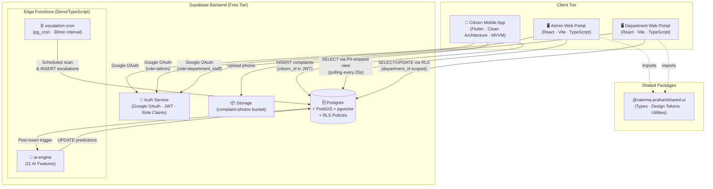
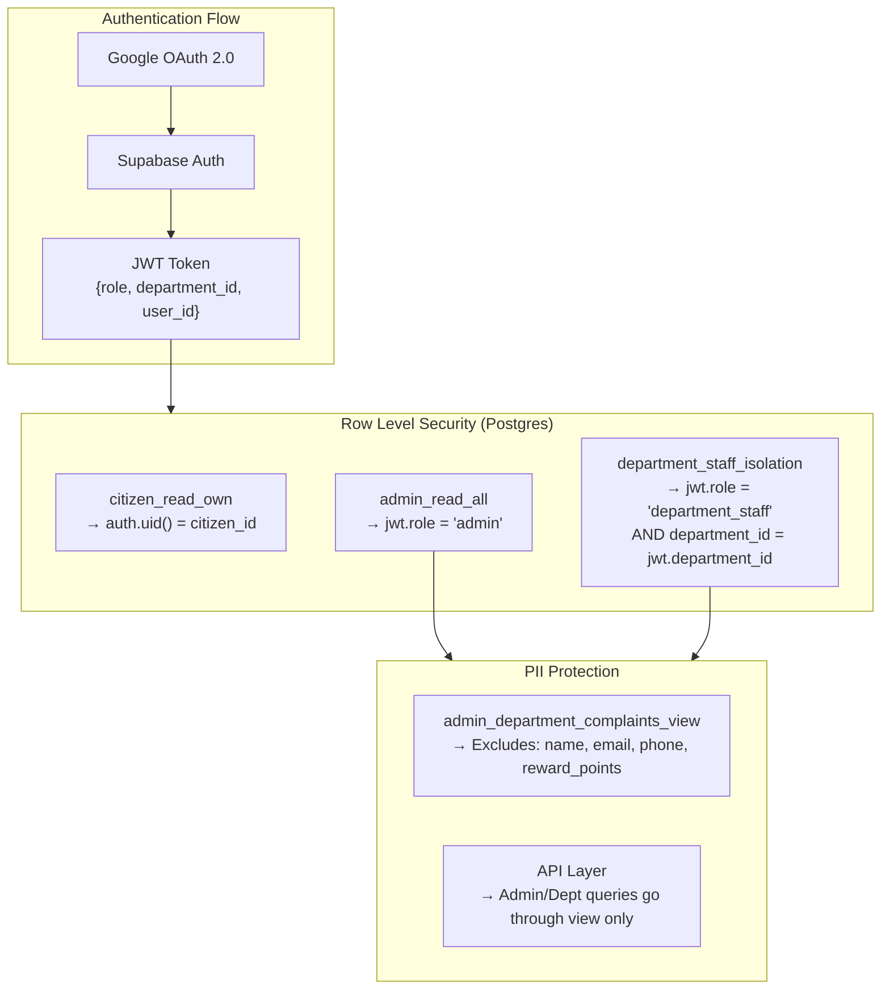
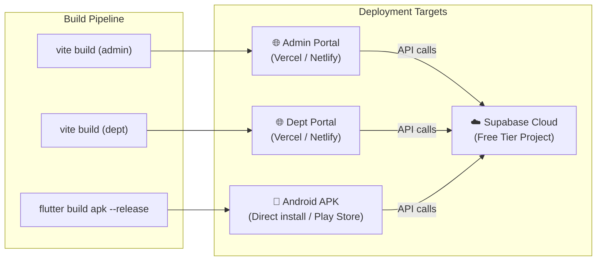

# Namma Prahari — System Architecture

> Version 1.0 · Phase 1 · August 2026

---

## 1 High-Level System Architecture



---

## 2 Data Flow Architecture

```mermaid
flowchart LR
    subgraph Submission["Complaint Submission Flow"]
        direction TB
        GPS["GPS Gate\n(Mandatory)"] --> LatLng["Fetch Lat/Lng"]
        LatLng --> Geocode["Reverse Geocode\n(Address · Ward · Constituency)"]
        Geocode --> Camera["Camera Capture"]
        Camera --> Preview["Photo Preview\n(Retake / Use)"]
        Preview --> Form["Category + Description"]
        Form --> Upload["Upload Photo → Storage"]
        Upload --> Insert["INSERT → complaints table"]
    end

    subgraph AIProcessing["AI Processing Pipeline"]
        direction TB
        Trigger["DB Trigger on INSERT"] --> Categorize["1. Auto-Categorize"]
        Categorize --> Validate["2. Image Validation"]
        Validate --> Spam["3. Spam Detection"]
        Spam --> Dedup["4. Duplicate Detection\n(PostGIS < 500m)"]
        Dedup --> Similar["5. Similar Complaints\n(pgvector KNN)"]
        Similar --> Severity["6. Severity Estimation"]
        Severity --> Priority["7. Priority Score"]
        Priority --> Route["8. Department Routing"]
        Route --> Title["9. Title Generation"]
        Title --> Summary["10. Summary Generation"]
        Summary --> ETA["11. Resolution ETA"]
        ETA --> Store["Store → ai_predictions"]
    end

    subgraph Monitoring["Monitoring & Resolution"]
        direction TB
        AdminPoll["Admin Portal\n(Polls every 25s)"]
        DeptPoll["Dept Portal\n(Polls every 25s, RLS-scoped)"]
        Transition["Status Transition\n(Assigned → In Progress → Resolved)"]
        Audit["Audit Log\n(complaint_history)"]
        Escalation["Escalation Engine\n(6h → 12h → 24h → 48h → 72h)"]
    end

    Insert --> Trigger
    Store --> AdminPoll
    Store --> DeptPoll
    DeptPoll --> Transition
    Transition --> Audit
    Insert --> Escalation
```



---

## 3 Clean Architecture — Flutter Mobile App

The Flutter app follows **Clean Architecture** with strict layer separation. Dependencies
point inward: `presentation → domain ← data`. The domain layer has zero framework imports.

```mermaid
flowchart TB
    subgraph Presentation["Presentation Layer"]
        direction LR
        Screens["Screens\n(login, home, report,\ntracking, leaderboard, profile)"]
        Widgets["Widgets\n(complaint_card, timeline,\ngps_dialog, status_chip)"]
        Providers["Riverpod Providers\n(StateNotifier · AsyncValue)"]
    end

    subgraph Domain["Domain Layer (Pure Dart — No Framework Imports)"]
        direction LR
        Entities["Entities\n(Complaint, User, Department,\nCategory, Notification, Reward)"]
        Repos["Repository Interfaces\n(abstract classes)"]
        UseCases["Use Cases\n(SubmitComplaint, GetHistory,\nGetLeaderboard, UpdateProfile)"]
    end

    subgraph Data["Data Layer"]
        direction LR
        Models["Models\n(JSON serialization,\nfromMap / toMap)"]
        DataSources["Data Sources\n(SupabaseRemoteDataSource,\nLocalCacheDataSource)"]
        RepoImpl["Repository Implementations"]
    end

    subgraph Core["Core Layer (Cross-Cutting)"]
        direction LR
        Config["Config\n(env_config, supabase_client)"]
        Services["Services\n(gps_service, camera_service,\ngeocode_service, notification_service)"]
        Theme["Theme\n(app_theme, app_colors,\napp_typography, design_tokens)"]
        Utils["Utils\n(validators, formatters,\nconstants, extensions)"]
    end

    Screens --> Providers
    Providers --> UseCases
    UseCases --> Repos
    RepoImpl -.->|"implements"| Repos
    RepoImpl --> DataSources
    RepoImpl --> Models
    DataSources --> Config

    style Domain fill:#1a3a2a,stroke:#10B981,stroke-width:2px
    style Presentation fill:#1a2340,stroke:#6366F1,stroke-width:2px
    style Data fill:#2a1a1a,stroke:#FF9500,stroke-width:2px
    style Core fill:#1a1a2a,stroke:#94A3B8,stroke-width:2px
```



### SOLID Mapping (Flutter)

| Principle | Implementation |
|---|---|
| **S** — Single Responsibility | Each use case handles one operation. Each screen manages one view. |
| **O** — Open/Closed | Repository interfaces in domain; new data sources (e.g., offline cache) extend without modifying existing code. |
| **L** — Liskov Substitution | `ComplaintRepository` interface → `ComplaintRepositoryImpl` substitutes seamlessly. Mock implementations for testing. |
| **I** — Interface Segregation | Separate repository interfaces: `ComplaintRepository`, `UserRepository`, `NotificationRepository`. No god-interfaces. |
| **D** — Dependency Inversion | Domain layer depends on abstractions (interfaces). Data layer provides concrete implementations. Riverpod wires them. |

---

## 4 Feature-Based Architecture — React Web Portals

Both React apps use **feature-based architecture** with a clear separation of concerns.
Each feature owns its components, hooks, and service calls. Shared logic lives in a
monorepo package (`@namma-prahari/shared-ui`).

```mermaid
flowchart TB
    subgraph AdminPortal["Admin Portal (admin_portal/src/)"]
        direction TB
        AppShell["App.tsx\n(Router Shell · Layout · AuthGuard)"]

        subgraph Features["features/"]
            Dashboard["dashboard/\n(DashboardPage · KpiCards · useDashboardData)"]
            Complaints["complaints/\n(ComplaintListPage · ComplaintDetailModal\n· useComplaints · complaintService)"]
            MapView["map/\n(MapPage · MapMarkers · useMapData)"]
            Analytics["analytics/\n(AnalyticsPage · Charts · useAnalytics)"]
            Reports["reports/\n(ReportsPage · ExportService)"]
        end

        subgraph SharedComponents["components/"]
            Sidebar["Sidebar.tsx"]
            Header["Header.tsx"]
            StatusChip["StatusChip.tsx"]
            PriorityBar["PriorityBar.tsx"]
        end

        subgraph Infra["Infrastructure"]
            Hooks["hooks/\n(usePolling · useAuth · useDebounce)"]
            ServicesDir["services/\n(supabaseClient · apiService)"]
            Context["context/\n(AuthContext · ThemeContext)"]
            Types["types/\n(admin.types.ts)"]
        end
    end

    AppShell --> Features
    Features --> SharedComponents
    Features --> Hooks
    Hooks --> ServicesDir
    ServicesDir -->|"@supabase/supabase-js"| External["Supabase"]

    style Features fill:#1a2340,stroke:#6366F1,stroke-width:2px
    style Infra fill:#1a1a2a,stroke:#94A3B8,stroke-width:2px
```



### SOLID Mapping (React)

| Principle | Implementation |
|---|---|
| **S** — Single Responsibility | Each feature folder owns one bounded context. Hooks handle data, components handle rendering. |
| **O** — Open/Closed | Service layer uses adapter pattern — swap Supabase client for mock service without changing hooks. |
| **L** — Liskov Substitution | `ApiService` interface → `SupabaseApiService` / `MockApiService` interchangeable. |
| **I** — Interface Segregation | Separate service interfaces: `ComplaintService`, `AuthService`, `AnalyticsService`. |
| **D** — Dependency Inversion | Hooks depend on service interfaces (injected via context). Components depend on hooks, never on services directly. |

---

## 5 Entity-Relationship Diagram

```mermaid
erDiagram
    USERS ||--o{ COMPLAINTS : "submits"
    USERS ||--o{ REWARDS : "earns"
    USERS }o--|| DEPARTMENTS : "belongs to (staff)"

    DEPARTMENTS ||--o{ CATEGORIES : "owns"
    DEPARTMENTS ||--o{ COMPLAINTS : "assigned to"

    CATEGORIES ||--o{ COMPLAINTS : "classified as"

    COMPLAINTS ||--o{ COMPLAINT_HISTORY : "has audit trail"
    COMPLAINTS ||--|| AI_PREDICTIONS : "has predictions"
    COMPLAINTS ||--o{ ESCALATIONS : "has escalations"
    COMPLAINTS ||--o{ NOTIFICATIONS : "triggers"

    REPRESENTATIVES ||--o{ COMPLAINTS : "represents ward"

    USERS {
        uuid id PK "FK auth.users"
        varchar role "citizen | admin | department_staff"
        uuid department_id FK "nullable"
        varchar name
        varchar email UK
        text avatar_url
        int reward_points "default 0"
        timestamptz created_at
    }

    COMPLAINTS {
        varchar id PK "INC-XXXXX"
        varchar title
        text description
        uuid category_id FK
        uuid department_id FK
        varchar severity "Low | Medium | High"
        int priority_score "0-100"
        varchar status "submitted | assigned | in_progress | resolved | escalated"
        float lat
        float lng
        geometry location_geom "PostGIS Point"
        text address
        varchar ward
        varchar assembly_constituency
        varchar parliamentary_constituency
        text image_url
        uuid citizen_id FK
        timestamptz created_at
        timestamptz updated_at
    }

    DEPARTMENTS {
        uuid id PK
        varchar code UK "BBMP_ROAD etc"
        varchar name
        varchar icon
        varchar head_officer
        varchar contact_email
    }

    CATEGORIES {
        uuid id PK
        varchar name
        uuid department_id FK
        varchar base_severity
        varchar icon
    }

    COMPLAINT_HISTORY {
        uuid id PK
        varchar complaint_id FK
        varchar status_from
        varchar status_to
        varchar changed_by_role
        text note
        timestamptz timestamp
    }

    AI_PREDICTIONS {
        uuid id PK
        varchar complaint_id FK_UK
        varchar category_predicted
        int priority_predicted
        varchar severity_predicted
        boolean is_spam
        boolean is_duplicate
        varchar duplicate_of_id
        text_array similar_ids
        text summary_generated
        vector description_vector "384-dim"
        int estimated_resolution_hours
        timestamptz created_at
    }

    ESCALATIONS {
        uuid id PK
        varchar complaint_id FK
        varchar level "6h | 12h | 24h | 48h | 72h"
        varchar escalated_to
        timestamptz timestamp
    }

    REWARDS {
        uuid id PK
        uuid citizen_id FK
        int points
        text reason
        timestamptz timestamp
    }

    NOTIFICATIONS {
        uuid id PK
        uuid user_id FK
        varchar title
        text body
        varchar type "status_update | escalation | reward | system"
        boolean read "default false"
        varchar complaint_id FK "nullable"
        timestamptz created_at
    }

    REPRESENTATIVES {
        uuid id PK
        varchar constituency_name UK
        varchar mla_name
        varchar mla_phone
        varchar mla_email
        varchar mp_name
        varchar mp_phone
        varchar mp_email
    }
```

---

## 6 Security Architecture



---

## 7 Deployment Architecture



---

## 8 Folder Structure Reference

### 8.1 Flutter Mobile App (`/mobile_app`)

```
mobile_app/
├── android/
├── ios/
├── lib/
│   ├── main.dart                              # App entry + Riverpod scope
│   ├── core/
│   │   ├── config/
│   │   │   ├── env_config.dart                # Supabase URL/key, Google Maps key
│   │   │   └── app_constants.dart             # Complaint ID prefix, polling intervals
│   │   ├── network/
│   │   │   └── supabase_client.dart           # Singleton Supabase client init
│   │   ├── services/
│   │   │   ├── gps_service.dart               # Geolocator wrapper + permission checks
│   │   │   ├── camera_service.dart            # Camera controller wrapper
│   │   │   ├── geocode_service.dart           # Reverse geocoding → address/ward/constituency
│   │   │   └── notification_service.dart      # Local + push notification handler
│   │   ├── theme/
│   │   │   ├── app_theme.dart                 # ThemeData (light + dark)
│   │   │   ├── app_colors.dart                # Color palette constants
│   │   │   └── app_typography.dart            # TextTheme definitions
│   │   ├── utils/
│   │   │   ├── validators.dart                # Input validation helpers
│   │   │   ├── formatters.dart                # Date, currency, ID formatters
│   │   │   └── extensions.dart                # Dart extension methods
│   │   └── router/
│   │       └── app_router.dart                # GoRouter configuration
│   ├── data/
│   │   ├── datasources/
│   │   │   ├── complaint_remote_datasource.dart
│   │   │   ├── user_remote_datasource.dart
│   │   │   └── notification_remote_datasource.dart
│   │   ├── models/
│   │   │   ├── complaint_model.dart           # JSON ↔ Dart
│   │   │   ├── user_model.dart
│   │   │   ├── category_model.dart
│   │   │   ├── notification_model.dart
│   │   │   └── reward_model.dart
│   │   └── repositories/
│   │       ├── complaint_repository_impl.dart
│   │       ├── user_repository_impl.dart
│   │       └── notification_repository_impl.dart
│   ├── domain/
│   │   ├── entities/
│   │   │   ├── complaint.dart
│   │   │   ├── user.dart
│   │   │   ├── category.dart
│   │   │   ├── department.dart
│   │   │   ├── notification.dart
│   │   │   └── reward.dart
│   │   ├── repositories/
│   │   │   ├── complaint_repository.dart      # Abstract interface
│   │   │   ├── user_repository.dart
│   │   │   └── notification_repository.dart
│   │   └── usecases/
│   │       ├── submit_complaint.dart
│   │       ├── get_complaint_history.dart
│   │       ├── get_complaint_detail.dart
│   │       ├── get_leaderboard.dart
│   │       ├── get_user_profile.dart
│   │       └── update_user_profile.dart
│   └── presentation/
│       ├── providers/
│       │   ├── auth_provider.dart
│       │   ├── complaint_provider.dart
│       │   ├── location_provider.dart
│       │   ├── leaderboard_provider.dart
│       │   └── notification_provider.dart
│       ├── screens/
│       │   ├── auth/
│       │   │   └── login_screen.dart
│       │   ├── home/
│       │   │   └── home_screen.dart
│       │   ├── report/
│       │   │   ├── gps_gate_screen.dart
│       │   │   ├── camera_screen.dart
│       │   │   ├── photo_preview_screen.dart
│       │   │   └── complaint_form_screen.dart
│       │   ├── tracking/
│       │   │   ├── complaint_list_screen.dart
│       │   │   └── complaint_detail_screen.dart
│       │   ├── leaderboard/
│       │   │   └── leaderboard_screen.dart
│       │   ├── notifications/
│       │   │   └── notifications_screen.dart
│       │   └── profile/
│       │       └── profile_screen.dart
│       └── widgets/
│           ├── complaint_card.dart
│           ├── status_chip.dart
│           ├── timeline_view.dart
│           ├── gps_dialog.dart
│           ├── category_selector.dart
│           ├── priority_indicator.dart
│           └── loading_shimmer.dart
├── test/
│   ├── unit/
│   ├── widget/
│   └── integration/
├── assets/
│   └── images/
└── pubspec.yaml
```

### 8.2 Admin Web Portal (`/admin_portal`)

```
admin_portal/
├── public/
│   └── favicon.svg
├── src/
│   ├── main.tsx                               # ReactDOM + QueryClient + BrowserRouter
│   ├── App.tsx                                # Router shell + AuthGuard + Layout
│   ├── components/
│   │   ├── layout/
│   │   │   ├── Sidebar.tsx
│   │   │   ├── Header.tsx
│   │   │   └── PageContainer.tsx
│   │   ├── shared/
│   │   │   ├── StatusChip.tsx
│   │   │   ├── PriorityBar.tsx
│   │   │   ├── SeverityBadge.tsx
│   │   │   ├── SearchBar.tsx
│   │   │   ├── FilterPills.tsx                # YouTube-Studio-style filter pills
│   │   │   ├── DataTable.tsx
│   │   │   ├── LoadingSkeleton.tsx
│   │   │   └── EmptyState.tsx
│   │   └── maps/
│   │       └── ComplaintMap.tsx
│   ├── features/
│   │   ├── dashboard/
│   │   │   ├── DashboardPage.tsx
│   │   │   ├── KpiCard.tsx
│   │   │   └── useDashboardData.ts
│   │   ├── complaints/
│   │   │   ├── ComplaintListPage.tsx
│   │   │   ├── ComplaintDetailModal.tsx
│   │   │   ├── ComplaintTimeline.tsx
│   │   │   ├── RepresentativePanel.tsx
│   │   │   ├── useComplaints.ts
│   │   │   └── complaintService.ts
│   │   ├── map/
│   │   │   ├── MapPage.tsx
│   │   │   └── useMapData.ts
│   │   ├── analytics/
│   │   │   ├── AnalyticsPage.tsx
│   │   │   ├── charts/
│   │   │   │   ├── CategoryDistribution.tsx
│   │   │   │   ├── DepartmentPerformance.tsx
│   │   │   │   ├── ResolutionTrends.tsx
│   │   │   │   └── WardHeatmap.tsx
│   │   │   └── useAnalytics.ts
│   │   └── reports/
│   │       ├── ReportsPage.tsx
│   │       └── exportService.ts
│   ├── hooks/
│   │   ├── usePolling.ts
│   │   ├── useAuth.ts
│   │   └── useDebounce.ts
│   ├── services/
│   │   ├── supabaseClient.ts
│   │   ├── apiService.ts                      # Interface
│   │   ├── supabaseApiService.ts              # Production implementation
│   │   └── mockApiService.ts                  # Mock fallback
│   ├── context/
│   │   ├── AuthContext.tsx
│   │   └── ThemeContext.tsx
│   ├── types/
│   │   └── index.ts
│   └── index.css                              # Design system CSS
├── index.html
├── package.json
├── tsconfig.json
├── tsconfig.node.json
├── vite.config.ts
├── tailwind.config.js
└── postcss.config.js
```

### 8.3 Department Web Portal (`/department_portal`)

```
department_portal/
├── public/
│   └── favicon.svg
├── src/
│   ├── main.tsx
│   ├── App.tsx                                # Router + AuthGuard (dept role check)
│   ├── components/
│   │   ├── layout/
│   │   │   ├── DeptSidebar.tsx
│   │   │   ├── DeptHeader.tsx
│   │   │   └── PageContainer.tsx
│   │   └── shared/
│   │       ├── StatusChip.tsx
│   │       ├── StatusTransitionModal.tsx
│   │       ├── AuditTimeline.tsx
│   │       └── LoadingSkeleton.tsx
│   ├── features/
│   │   ├── dashboard/
│   │   │   ├── DeptDashboardPage.tsx
│   │   │   ├── DeptKpiCard.tsx
│   │   │   └── useDeptDashboard.ts
│   │   ├── queue/
│   │   │   ├── ComplaintQueuePage.tsx
│   │   │   ├── QueueCard.tsx
│   │   │   ├── useComplaintQueue.ts
│   │   │   └── queueService.ts
│   │   └── history/
│   │       ├── ComplaintHistoryPage.tsx
│   │       ├── HistoryTimeline.tsx
│   │       └── useComplaintHistory.ts
│   ├── hooks/
│   │   ├── usePolling.ts
│   │   ├── useAuth.ts
│   │   └── useDeptFilter.ts
│   ├── services/
│   │   ├── supabaseClient.ts
│   │   ├── deptApiService.ts
│   │   └── mockDeptApiService.ts
│   ├── context/
│   │   ├── AuthContext.tsx
│   │   └── DeptContext.tsx
│   ├── types/
│   │   └── index.ts
│   └── index.css
├── index.html
├── package.json
├── tsconfig.json
├── tsconfig.node.json
├── vite.config.ts
├── tailwind.config.js
└── postcss.config.js
```

### 8.4 Supabase Backend (`/supabase`)

```
supabase/
├── migrations/
│   ├── 20260805000000_initial_schema.sql      # Tables, RLS, views, seed data
│   ├── 20260805000001_notifications_table.sql # Notifications table
│   └── 20260805000002_indexes_functions.sql   # Indexes, triggers, helper functions
├── functions/
│   ├── ai-engine/
│   │   └── index.ts                           # 11 AI features Edge Function
│   └── escalation-cron/
│       └── index.ts                           # SLA escalation scheduled function
└── config.toml                                # Supabase CLI config
```

### 8.5 Shared Package (`/packages/shared_ui`)

```
packages/shared_ui/
├── src/
│   ├── index.ts                               # Shared TypeScript interfaces
│   ├── tokens.ts                              # Design token constants
│   └── mockData.ts                            # Mock data for offline development
└── package.json
```
