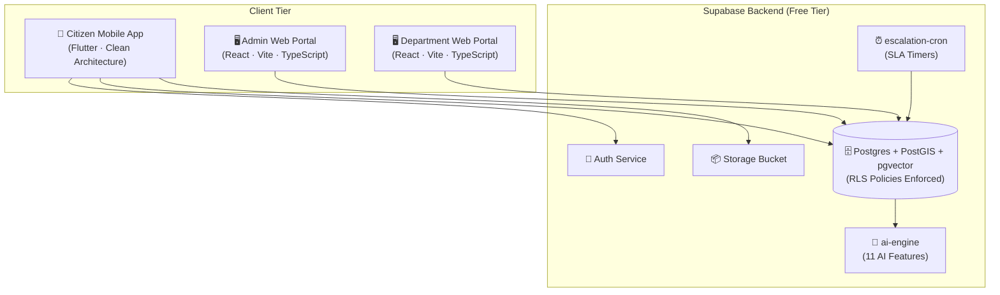
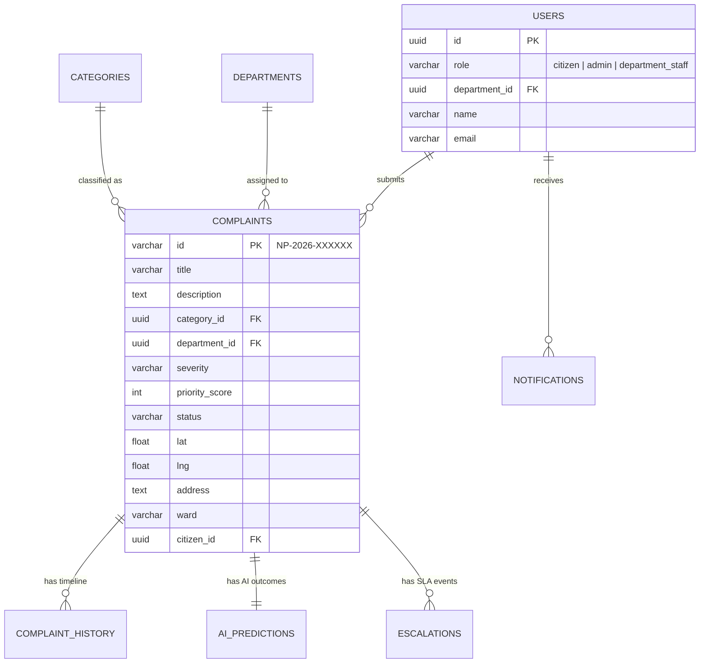
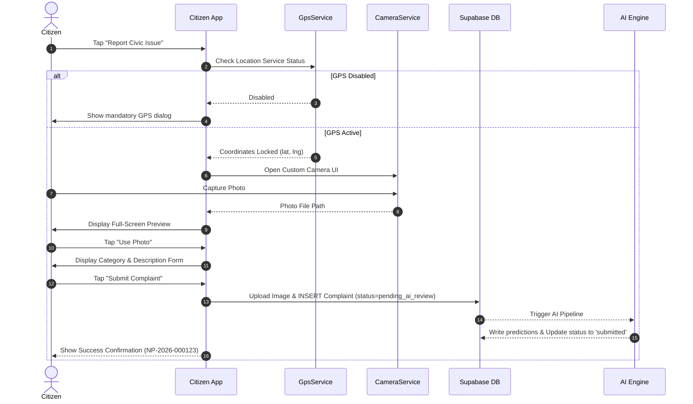

# Namma Prahari — System Diagrams

> Comprehensive Mermaid diagrams illustrating System Architecture, Entity-Relationships, Sequence Flows, Activity, and Use Cases.

---

## 1 High-Level Architecture Diagram

---

## 2 Entity-Relationship (ER) Diagram

---

## 3 Sequence Diagram: Citizen Complaint Submission

