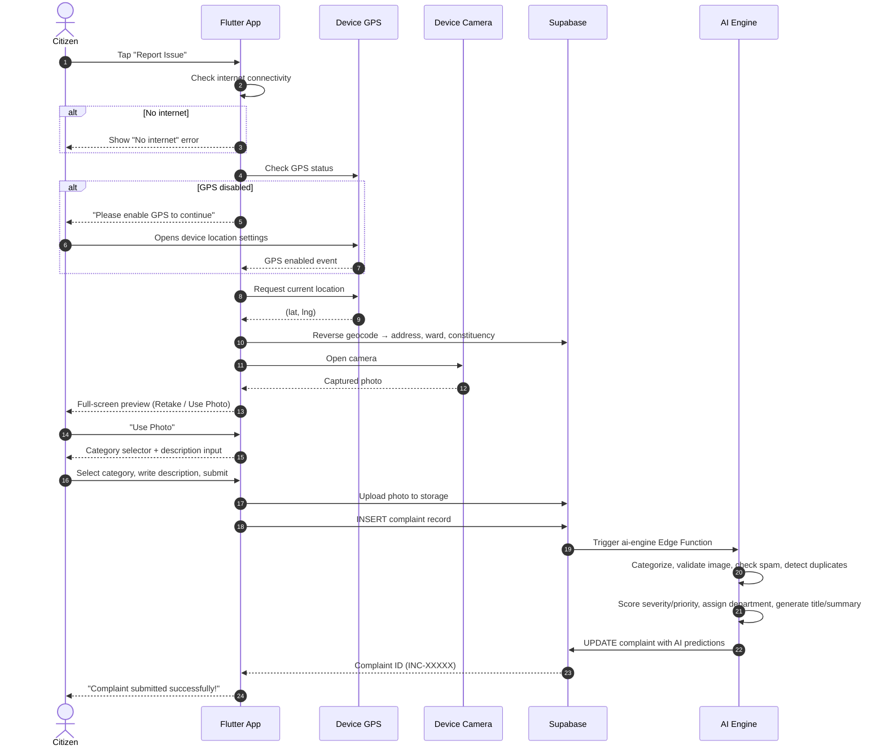
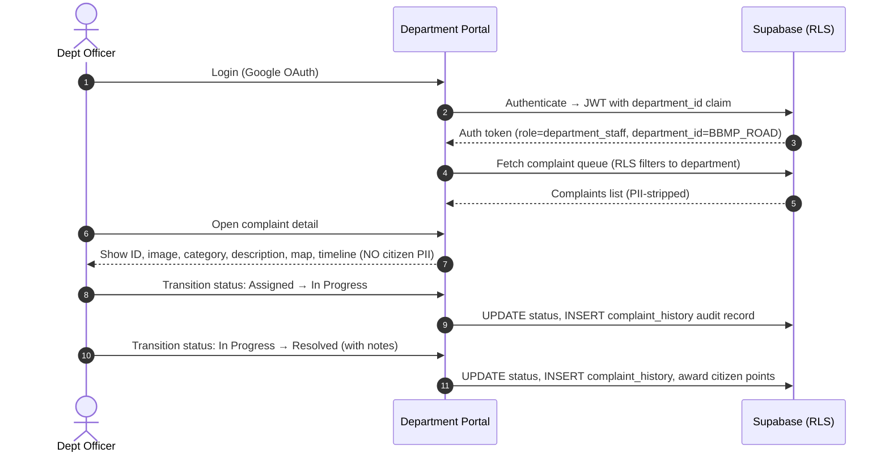
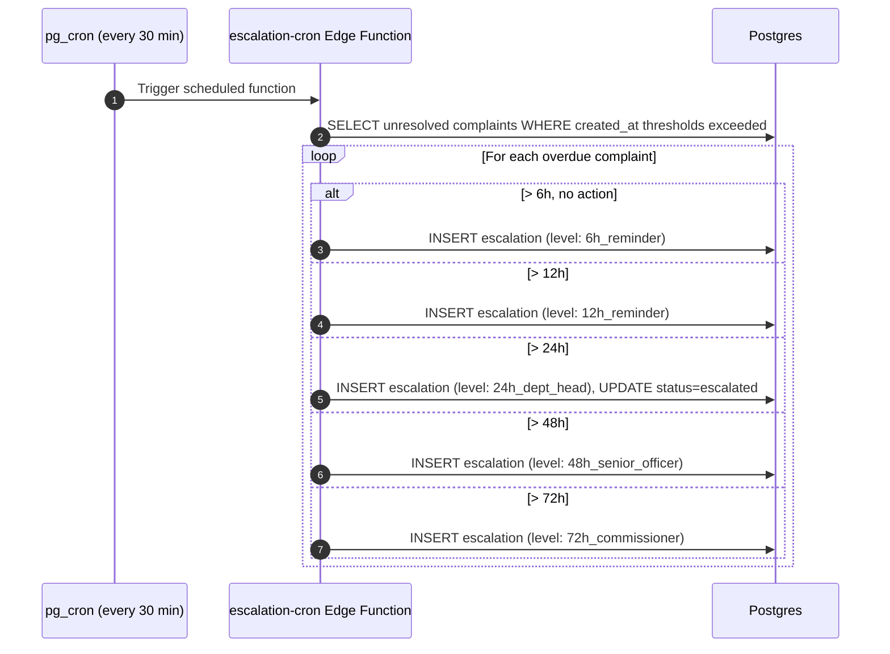

# Namma Prahari — Requirements Specification

> Version 1.0 · Phase 1 · August 2026

---

## 1 Project Overview

Namma Prahari ("Our Sentinel") is a production-grade Smart Civic Issue Reporting &amp; Management
Platform built for Bengaluru Urban Local Bodies. Citizens photograph infrastructure defects
through a mobile app; the platform's AI engine categorises, validates, and routes each complaint
to the responsible government department; administrators and department officers monitor, manage,
and resolve complaints through separate web portals.

**Three client applications + one backend + one AI layer:**

| # | Application | Platform | Primary Users |
|---|---|---|---|
| 1 | Citizen Mobile App | Flutter (Android primary, iOS-ready) | Citizens |
| 2 | Admin Web Portal | React + Vite + TypeScript | City Commissioners, Nodal Officers |
| 3 | Department Web Portal | React + Vite + TypeScript | Department Officers (Road, SWM, Water, Electrical) |
| 4 | Backend | Supabase (Postgres, Auth, Storage, Edge Functions, pg_cron) | — |
| 5 | AI Engine | Supabase Edge Functions (Deno/TS) | — |

---

## 2 Functional Requirements

### 2.1 Citizen Mobile App (`/mobile_app`)

| ID | Requirement | Priority |
|---|---|---|
| FR-M01 | Google OAuth sign-in via Supabase Auth | P0 |
| FR-M02 | User profile screen (name, avatar, total points, total complaints) | P0 |
| FR-M03 | Home dashboard showing recent complaints, quick-report CTA | P0 |
| FR-M04 | **GPS Gate**: Before camera can open, device GPS must be active. If GPS is off, show "Please enable GPS to continue" with "Open Device Location Settings" button. Enforce dynamically even if GPS is toggled off mid-flow. | P0 |
| FR-M05 | Fetch lat/lng → reverse-geocode → auto-fill address, ward, assembly constituency, parliament constituency | P0 |
| FR-M06 | Open camera → capture photo → full-screen preview with Retake / Use Photo | P0 |
| FR-M07 | Category selection (Road, Garbage, Water, Street Light, Drainage, Other) | P0 |
| FR-M08 | Description text input (minimum 10 characters) | P0 |
| FR-M09 | AI validation pass before submission (image quality, spam check) | P0 |
| FR-M10 | Submit complaint → store in Supabase (complaints table + storage bucket) | P0 |
| FR-M11 | Complaint history list (all own complaints, filterable by status) | P0 |
| FR-M12 | Complaint detail with full status timeline | P0 |
| FR-M13 | Push/in-app notifications on status changes | P1 |
| FR-M14 | Leaderboard of top citizen reporters (rank, verified submissions, points) | P1 |
| FR-M15 | Reward points system (+50 for verified non-spam submission, penalties for spam) | P1 |
| FR-M16 | Logout | P0 |

**Strict boundary**: The mobile app NEVER manages department workflows, assigns officers, or transitions complaint statuses. It is citizen-only.

### 2.2 Admin Web Portal (`/admin_portal`)

| ID | Requirement | Priority |
|---|---|---|
| FR-A01 | Auth via Supabase (admin role check on JWT claims) | P0 |
| FR-A02 | Dashboard KPIs: Total, Active, Resolved, SLA Overdue, Avg Resolution Time, Active Departments | P0 |
| FR-A03 | Cross-department complaint list with search by ID, category, ward, status, priority, date range, MLA/MP | P0 |
| FR-A04 | Complaint detail modal: Complaint ID, Image (zoomable), Category, Description, Priority, Status, Date/Time, Lat/Lng, Full Address, Ward, Assembly Constituency, Parliament Constituency, Google Maps embed, Assigned Department, Complaint Timeline, Resolution Timeline, Escalation Timeline | P0 |
| FR-A05 | **Privacy enforcement (API-level)**: complaint detail NEVER includes citizen name, email, phone, or reward points. The API/view itself excludes these fields. | P0 |
| FR-A06 | Responsible representatives panel: Ward MLA &amp; MP (name, official phone, official email) derived from complaint GPS coordinates | P0 |
| FR-A07 | Interactive live complaint map (Google Maps JS or Leaflet/OSM fallback) with cluster markers, category filter | P0 |
| FR-A08 | Analytics: ward-wise heatmap, department performance, resolution trends, category distribution, severity breakdown | P1 |
| FR-A09 | Monthly executive report export (CSV/PDF) | P2 |
| FR-A10 | Smart polling: auto-refresh every 25s, refresh on window focus, refresh after any update | P0 |

**Strict boundary**: NEVER contains complaint submission forms, upload, or image capture tools.

### 2.3 Department Web Portal (`/department_portal`)

| ID | Requirement | Priority |
|---|---|---|
| FR-D01 | Auth via Supabase with department_id JWT claim | P0 |
| FR-D02 | Department-scoped dashboard: Pending, In Progress, Resolved Today, Overdue | P0 |
| FR-D03 | Complaint work queue (only own department's complaints via RLS) | P0 |
| FR-D04 | Status transition workflow: Submitted → Assigned → In Progress → Resolved, with officer notes and audit logging | P0 |
| FR-D05 | Complaint detail (same as admin, PII-stripped, department-scoped) | P0 |
| FR-D06 | **Row Level Security (RLS) enforcement at database layer**: A Road Dept user CANNOT see, query, or modify complaints assigned to Water/SWM/Electrical. Enforced via Postgres policies, not UI guards. | P0 |
| FR-D07 | Smart polling (same as admin portal) | P0 |

**Strict boundary**: NEVER contains complaint submission. NEVER exposes citizen PII.

### 2.4 Backend — Supabase

| ID | Requirement | Priority |
|---|---|---|
| FR-B01 | Postgres schema: users, complaints, departments, categories, complaint_history, ai_predictions, escalations, rewards, representatives | P0 |
| FR-B02 | PostGIS extension for spatial queries and proximity search | P0 |
| FR-B03 | pgvector extension for complaint similarity embeddings | P0 |
| FR-B04 | RLS on every user-facing table | P0 |
| FR-B05 | `admin_department_complaints_view` — PII-stripped view for admin/department queries | P0 |
| FR-B06 | Supabase Auth with Google OAuth provider, custom JWT claims (`role`, `department_id`) | P0 |
| FR-B07 | Storage bucket for complaint photos (max 5 MB, public read, auth write) | P0 |
| FR-B08 | Edge Function: `ai-engine` — triggered on complaint insert | P0 |
| FR-B09 | Edge Function: `escalation-cron` — scheduled via pg_cron every 30 min | P0 |
| FR-B10 | Complaint ID format: `INC-XXXXX` (auto-generated sequential) | P0 |

### 2.5 AI Engine (Version 1 — Not Deferred)

| ID | Feature | Free-Tier Technique | Priority |
|---|---|---|---|
| FR-AI01 | Automatic Complaint Categorization | Keyword matrix + TF-IDF scoring | P0 |
| FR-AI02 | Image Validation | Histogram variance, blur detection (Laplacian), exposure check | P0 |
| FR-AI03 | Spam Detection | Gibberish filter, pattern matching, rate limiting | P0 |
| FR-AI04 | Duplicate Complaint Detection | PostGIS proximity (&lt;500m) + text cosine similarity (pgvector) | P0 |
| FR-AI05 | Similar Complaint Detection | pgvector nearest-neighbor search | P1 |
| FR-AI06 | Severity Estimation | Deterministic scoring engine (category weight + keyword severity + location density) | P0 |
| FR-AI07 | Priority Prediction | Multi-factor: severity × recency × area density × escalation history | P0 |
| FR-AI08 | Automatic Department Assignment | Category → Department mapping table | P0 |
| FR-AI09 | Automatic Title Generation | Extractive: category + location + severity template | P1 |
| FR-AI10 | Complaint Summary Generation | Extractive summarizer (first sentence + key phrases) | P1 |
| FR-AI11 | Estimated Resolution Time | Historical statistical query (median by category + department) | P1 |

**No chatbot. No paid AI APIs.**

### 2.6 Escalation System

| Elapsed Time | Action |
|---|---|
| 6 hours | Reminder notification to assigned department |
| 12 hours | Second reminder to department |
| 24 hours | Escalate to Department Head |
| 48 hours | Escalate to Senior Officer |
| 72 hours | Escalate to Commissioner |

Every escalation event is logged in the `escalations` table with timestamp, level, and escalated-to officer.

---

## 3 Non-Functional Requirements

### 3.1 Performance

| ID | Requirement |
|---|---|
| NFR-01 | Web portal initial load &lt; 3s on 4G connection |
| NFR-02 | Complaint submission end-to-end &lt; 5s (excluding photo upload) |
| NFR-03 | Map renders with up to 10,000 markers using clustering without jank |
| NFR-04 | Polling interval: 20–30s, must not block UI thread |
| NFR-05 | Mobile app cold start &lt; 2s on mid-range Android device |

### 3.2 Security

| ID | Requirement |
|---|---|
| NFR-06 | Google OAuth via Supabase Auth for all client apps |
| NFR-07 | JWT-based session management with role and department_id claims |
| NFR-08 | Row Level Security on every table (citizens see own, departments see own, admins see all) |
| NFR-09 | PII never returned to admin/department roles — enforced at database view level |
| NFR-10 | HTTPS enforced for all API communication |
| NFR-11 | Input validation on all user inputs (XSS, SQL injection prevention) |
| NFR-12 | Image upload: max 5 MB, allowed MIME types only (image/jpeg, image/png, image/webp) |

### 3.3 Scalability &amp; Reliability

| ID | Requirement |
|---|---|
| NFR-13 | Free-tier compliant: Supabase free plan, no paid extensions or APIs |
| NFR-14 | Graceful degradation: app works with mock data if Supabase is unreachable |
| NFR-15 | No Supabase Realtime — polling only |
| NFR-16 | Database indexes on frequently queried columns (status, department_id, ward, created_at, location_geom) |

### 3.4 Maintainability

| ID | Requirement |
|---|---|
| NFR-17 | Clean Architecture (Flutter): core → data → domain → presentation layers |
| NFR-18 | Feature-based architecture (React): each feature in its own folder with components, hooks, services |
| NFR-19 | MVVM pattern in Flutter; Repository pattern in both Flutter and React |
| NFR-20 | SOLID principles enforced (single responsibility per file, dependency inversion via providers) |
| NFR-21 | Design system tokens shared across all three client apps |

### 3.5 Testing

| ID | Requirement |
|---|---|
| NFR-22 | Unit tests for all domain-layer use cases and utility functions |
| NFR-23 | Widget tests for critical Flutter UI components |
| NFR-24 | Integration tests for complaint submission flow |
| NFR-25 | End-to-end tests for critical user journeys |
| NFR-26 | React component tests with Testing Library |

### 3.6 Documentation

| ID | Requirement |
|---|---|
| NFR-27 | README with project overview, setup, and run instructions |
| NFR-28 | Setup guide for Supabase, Google Cloud, Flutter SDK |
| NFR-29 | Deployment guide for web (Vercel/Netlify) and mobile (APK) |
| NFR-30 | API documentation (Swagger for Edge Functions HTTP endpoints) |
| NFR-31 | Diagrams: ER, architecture, sequence, activity, use case (Mermaid) |

---

## 4 User Journeys

### 4.1 Citizen: Report an Issue

### 4.2 Department Officer: Resolve a Complaint

### 4.3 Escalation Engine (Automated)

---

## 5 Database Entity Summary

| Entity | Key Fields | Notes |
|---|---|---|
| `users` | id (FK auth.users), role, department_id, name, email, avatar_url, reward_points | PII fields never exposed to admin/dept roles |
| `complaints` | id (INC-XXXXX), title, description, category_id, department_id, severity, priority_score, status, lat/lng, location_geom, address, ward, constituency fields, image_url, citizen_id | Central entity |
| `departments` | id, code, name, icon, head_officer, contact_email | BBMP_ROAD, BBMP_SWM, BWSSB_WATER, BESCOM_ELEC |
| `categories` | id, name, department_id, base_severity, icon | Maps 1:1 to departments |
| `complaint_history` | id, complaint_id, status_from, status_to, changed_by_role, note, timestamp | Full audit trail |
| `ai_predictions` | id, complaint_id, all 11 AI output fields, description_vector | pgvector for similarity |
| `escalations` | id, complaint_id, level, escalated_to, timestamp | 5-tier escalation log |
| `rewards` | id, citizen_id, points, reason, timestamp | Points ledger |
| `representatives` | id, constituency_name, mla_name/phone/email, mp_name/phone/email | Reference data |
| `notifications` | id, user_id, title, body, type, read, complaint_id, timestamp | Push/in-app notifications |

---

## 6 Search Capabilities

Both web portals support search by:
- Complaint ID (exact match or prefix)
- Category
- Ward
- Area / Address (text search)
- Department
- Status
- Date range
- Priority / Severity
- MLA name
- MP name

---

## 7 Constraints &amp; Assumptions

### Stated Assumptions
1. **No Supabase Realtime** — All live data implemented via polling (20–30s interval).
2. **Free-tier only** — All services (Supabase, Google Cloud) operate within free-tier limits.
3. **Google Maps fallback** — If Google Maps API key is not provided, Leaflet/OpenStreetMap is used.
4. **Bengaluru focus** — Representative data (MLA/MP) is seeded for Bengaluru constituencies. The system architecture supports other cities via reference data updates.
5. **Android primary** — Flutter app targets Android first; iOS and web are architecturally supported but not the primary build target for V1.
6. **No chatbot** — Explicitly excluded from scope.
7. **No AI-generated images** — Only real user-captured photos, Material Icons, official logos, and Google Maps tiles.
