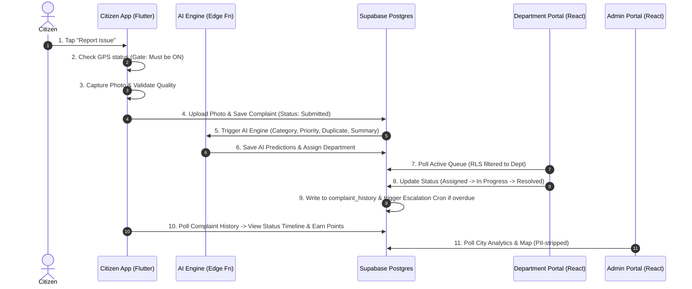

# Namma Prahari — Requirements & Scope Specification

## Project Overview
Namma Prahari ("Our Sentinel") is a production-grade Government Civic Issue Reporting & Management Platform. It enables citizens to report infrastructure hazards (roads, garbage, water supply, streetlights, drainage) while providing government departments and city administrators with real-time monitoring, automated routing, SLA escalation, and resolution workflows.

---

## The Three Applications & Boundaries

### 1. Citizen Mobile App (`/mobile_app`)
- **Platform**: Flutter (Android primary, iOS-ready, PWA runner)
- **Target User**: Citizens of Bengaluru / Urban Local Bodies
- **Core Capabilities**:
  - Google OAuth Authentication via Supabase Auth.
  - **Mandatory GPS Gate**: Checks device location services before opening camera.
  - Camera capture with client-side quality validation (blur/darkness check).
  - Categorization, description, location reverse-geocoding, ward lookup.
  - Track complaint status timeline, receive in-app notifications.
  - View verified leaderboard & reward points for genuine contributions.
- **Strict Boundary**: Can ONLY submit & track own complaints. Cannot manage department workflows.

### 2. Admin Web Portal (`/admin_portal`)
- **Platform**: React + Vite + TypeScript + Tailwind CSS
- **Target User**: City Commissioners, Nodal Officers, City Command Center
- **Core Capabilities**:
  - High-level KPIs (total, active, resolved, SLA overdue, avg resolution time).
  - Cross-department complaint monitoring & search by ID, category, ward, MLA/MP, priority.
  - Interactive Live Complaint Map with cluster filtering & auto-polling.
  - Analytics & Power-BI style charts (heatmaps, department performance, resolution trends).
  - Responsible Representatives panel (Ward MLA & MP contact directory).
- **STRICT BOUNDARY**: 
  - **NEVER contains complaint submission forms or image capture tools.**
  - **NEVER exposes Citizen PII** (Name, Email, Phone, Reward Points) — stripped server-side.

### 3. Department Web Portal (`/department_portal`)
- **Platform**: React + Vite + TypeScript + Tailwind CSS
- **Target User**: Department Officers (BBMP Road Dept, BESCOM Electrical, BWSSB Water, Solid Waste Management)
- **Core Capabilities**:
  - Login scoped strictly to assigned department via JWT `department_id`.
  - Department dashboard (Pending, In Progress, Resolved Today, Overdue, SLA status).
  - Complaint resolution workflow (Status transitions, officer assignment, photo verification).
- **STRICT BOUNDARY**:
  - **Row Level Security (RLS) Enforcement**: Strictly isolated. A Road Dept user CANNOT read or query Garbage Dept complaints.
  - **NEVER contains complaint submission forms.**
  - **NEVER exposes Citizen PII.**

---

## Out-Of-Scope Explicit Boundaries
- NO AI Chatbot anywhere in any application.
- NO paid APIs or paid AI services (all AI features use free-tier open-source ML, postgis, pgvector, or deterministic rules).
- NO Supabase Realtime WebSocket connections (all live updates implemented via smart 20-30s polling).
- NO fabricated AI-generated photos — real user photos and official maps only.

---

## Primary User Journeys

